## Housing_prices_prediction_ML

This is a King County Real Estate Market Analysis using Machine Learning models to predict house sale prices based on house-charectarizing features. The dataset was obtained from Kaggle and consists of historic data of houses sold in King County, Washington from May 2014 to May 2015.

## EDA
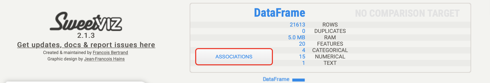
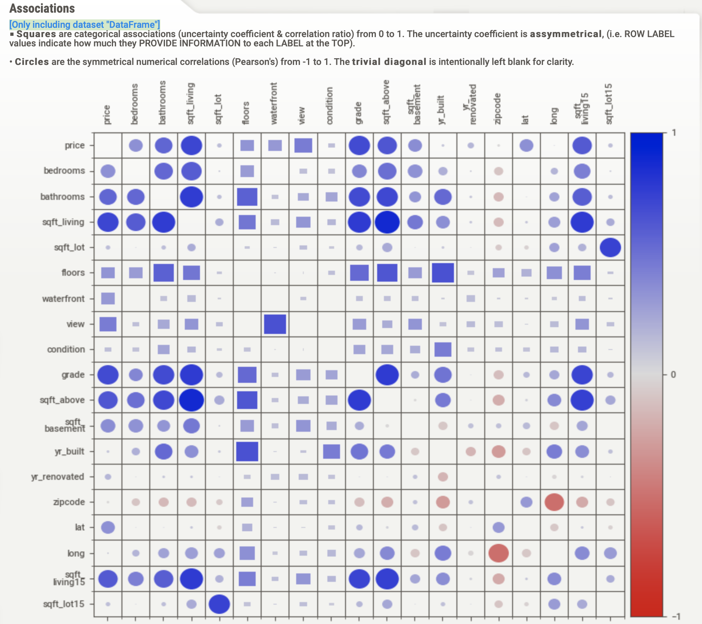

---
## Technologies
Python 3.7 with the following libraries:
 ```
 Python
 
 ```

* [pandas](https://github.com/pandas-dev/pandas)
* [numpy](https://github.com/numpy/numpy)
* [hvplot](https://github.com/holoviz/hvplot)
* [seaborn](https://seaborn.pydata.org/)
* [scikit-learn](https://scikit-learn.org/stable/)
* [sweetviz](https://github.com/fbdesignpro/sweetviz)

---
## Usage


To use the Housing_prices_prediction_ML clone the repository install packages listed in Technologies, open it with Jupyterlab and run the 

    * kc_housing.ipynb

---

## Overview of the Analysis

Project objectives are to find the best performing ML model, also to find out which features affect the price the most. We build the prediction based on the data from the kc_housing.csv file in the Data folder. First, we catculate the accuracy for 5 different ML models on the initial data, then try to improve the performance using feature engeneering and clustering. The metrics defining the performance of the chosen method will be calculated again at the end to prove the improvment. 

Through the project we use Linear Regression, Random Forests Regressor and Gradient Boost Regressor.

------
## Results

Evaluation of all machine learning models.

* Linear Regression:

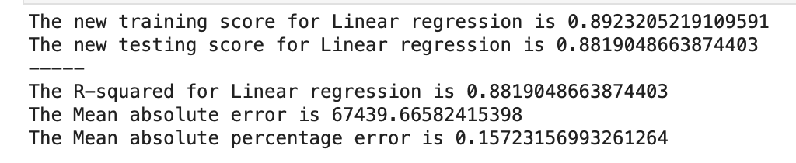


* Random Forest:

  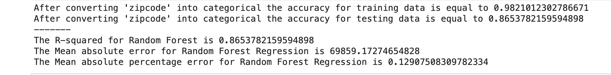
  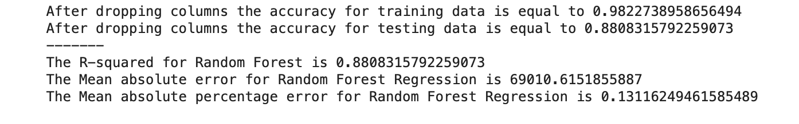
  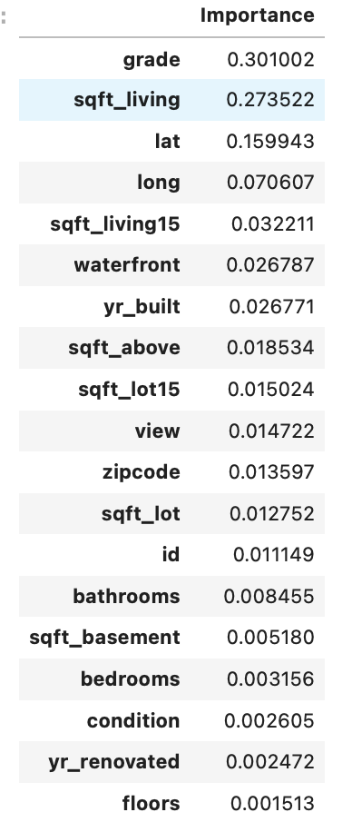

* GradientBoost Regressor:

  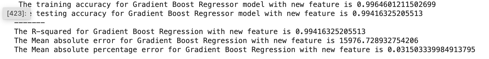
  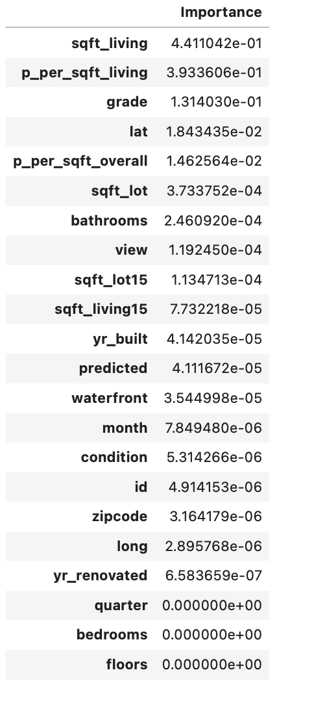


## Summary

Summarizing the results of the machine learning models we want to show the accuracy score with initial data and at the end.
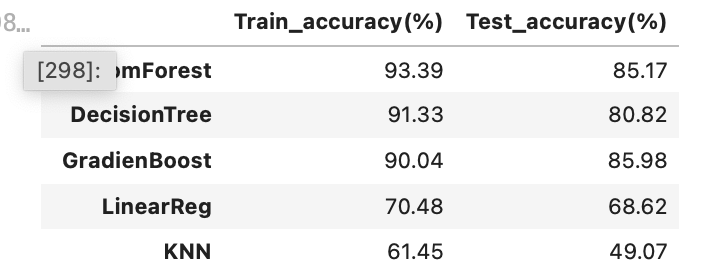
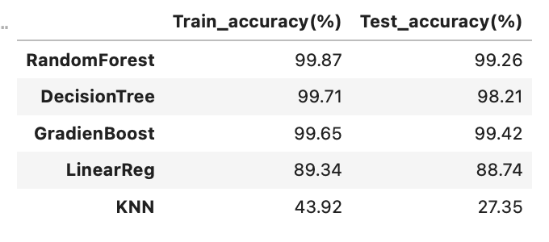
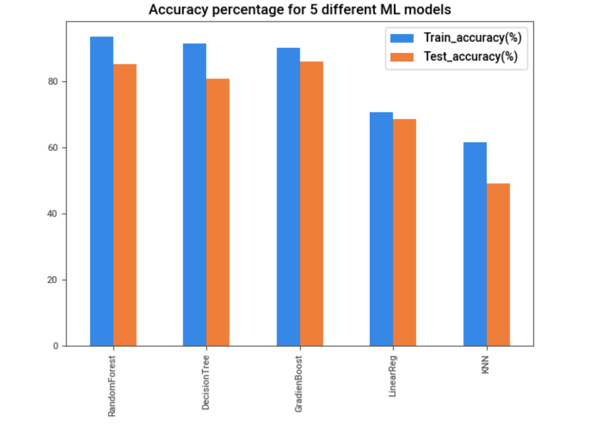
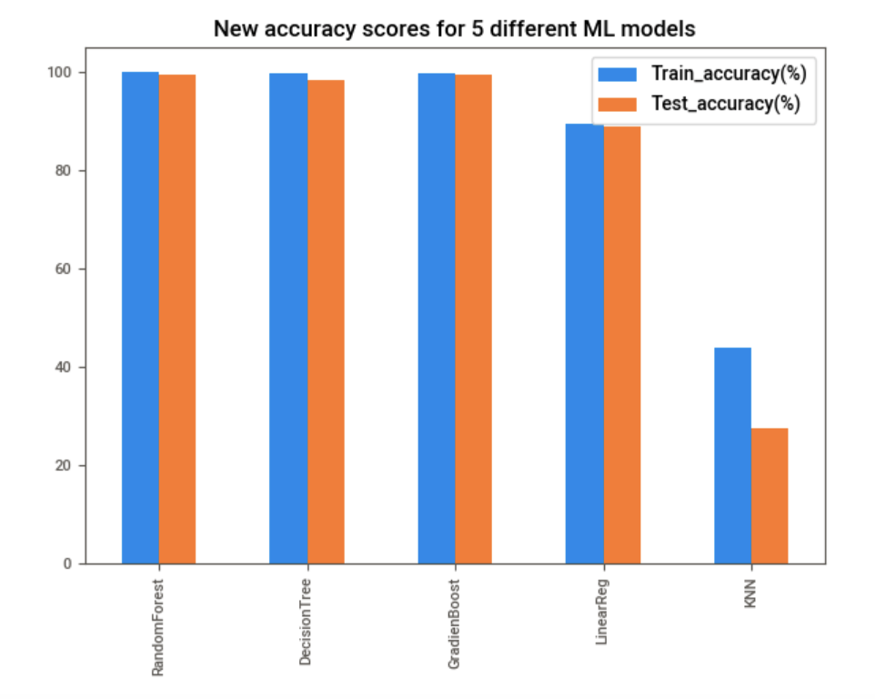

## Contributors

[Nara Arakelyan](https://github.com/arakelyannara)

[Dylan Nelson](https://github.com/anythingelse-sf)

[Noah Beito](https://www.linkedin.com/in/noah-beito/)

---
## License

UC Berkley

[MIT](https://github.com/git/git-scm.com/blob/main/MIT-LICENSE.txt)
